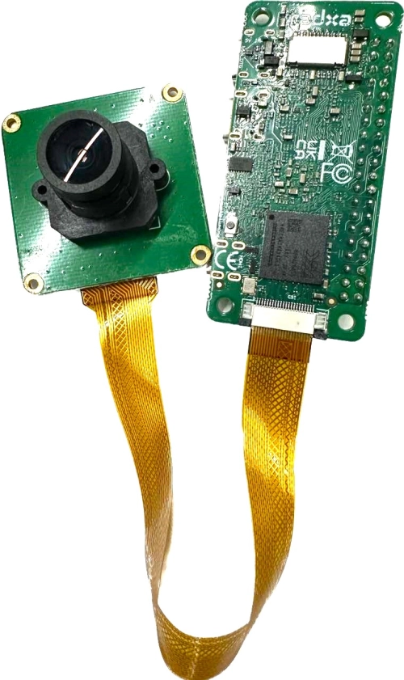

# Radxa Zero 3W / Camera 8M219：排线调整后成功出图

2026-09-28，官方 Bookworm KDE B1 下已经读到 IMX219 芯片 ID，并完成 **40 帧、1920×1080 的短时采集**。用户检查并调整排线正反面后，原先的识别失败消失。

## 接线先看这里

<p align="center"></p>

*图片由项目维护者提供，用于提醒排线两端的朝向；不是本次测试的现场照片，也不是采集画面。不同摄像头模组的连接器位置可能不同。*

图中左侧为镜头面，右侧为主板背面。**两端都要检查裸露金属触点与插座内的金属弹片是否相对**，不能只看排线的文字面、颜色或覆膜下面的铜走线。照片里的整体姿态只作对照，不能代替触点检查。

- ZERO 3W / 3E 配 Radxa Camera 8M219，官方规格是 **22 pin、0.5 mm → 15 pin、1.0 mm，同面触点排线**。“同面”指自然平铺时两端裸露接触区在同一侧。
- **先正常关机，再切断 HAT 和 USB 等全部供电，然后操作锁扣和排线。** 系统关机不等于接口已经断电。
- 平直插到底，确认无横向错位，并按连接器的实际结构锁紧。不要通电翻线试方向。
- 官方 ZERO 3 通用教程用的是 Pi Camera V1.3 / OV5647 示例，不能把示例的镜头朝向直接套到 8M219 上。

## 这次使用的系统和配置

| 项目 | 本次实测 |
|---|---|
| 主板 | Radxa Zero 3W，设备树兼容项含 `radxa,zero3w-aic8800ds2` |
| 摄像头 | **Radxa Camera 8M219（IMX219）**；芯片相同不等于实物就是 Raspberry Pi Camera V2 |
| 系统 | 官方 Bookworm KDE B1 / Debian 12 |
| 内核 | `6.1.84-10-rk2410-nocsf` |
| 摄像头 overlay | `/boot/dtbo/radxa-zero3-radxa-camera-8m.dtbo` |
| 图像处理服务 | `rkaiq_3A.service`，采集时为 active |
| 成功输出 | `/dev/video0`（rkisp_mainpath），1920×1080 JPEG |

烧录底包来自 [Radxa 官方 rsdk-b1](https://github.com/radxa-build/radxa-zero3/releases/tag/rsdk-b1)。本机测试卡仅在官方首次启动配置里预置 Wi-Fi 和启用 SSH；配置分区之外的字节与原版相同。**摄像头 overlay 是启动后另外通过官方工具启用的**，不是原版卡默认已启用。

这张官方测试卡不等同于本目录的 Armbian 成品卡，账号、内核和启动配置不同；本轮未在官方卡安装机器人运行时。官方卡也不能套用 Armbian 卡“插电脑自动出现 COM”的承诺。

## 从识别失败到成功的证据

调整排线前，原 Armbian 和官方 B1 都出现过：

```text
imx219 2-0010: Reading register 100 from 10 failed
imx219 2-0010: Error -5 setting default controls
imx219: probe of 2-0010 failed with error -5
```

此时虽有 `/dev/media0` 和 `/dev/video0..9`，却没有 IMX219 传感器实体，`2-0010` 没有绑定驱动；定点读取芯片 ID 也返回 ENXIO。

调整排线并重新上电后，在官方系统下读到：

```text
imx219 2-0010: Model ID 0x0219, Lot ID 0x512035, Chip ID 0x0732
rkisp-vir0: Async subdev notifier completed
```

`2-0010` 已绑定 `imx219`，媒体拓扑出现 `m00_b_imx219 2-0010`（`/dev/v4l-subdev3`），传感器 → DPHY → ISP 链路启用，随后实际采集成功。

## 官方 B1 下的复测命令

这组命令用于本次版本与 **8M219**，不要直接套到其他相机或 Armbian 配置文件里。先保存现有启动配置，再用官方工具启用对应 overlay：

```bash
sudo rsetup enable_overlays radxa-zero3-radxa-camera-8m.dtbo
sudo reboot
```

重连 SSH 后，逐层确认：

```bash
uname -r
sudo dmesg | grep -Ei 'imx219|rkisp|csi2-dphy'
readlink -f /sys/bus/i2c/devices/2-0010/driver
media-ctl -d /dev/media0 -p
systemctl is-active rkaiq_3A
```

确认没有其他程序占用摄像头后限量抓帧；需要系统已提供 `gst-launch-1.0`、V4L2、视频转换和 JPEG 编码插件：

```bash
timeout 25s gst-launch-1.0 -e \
  v4l2src device=/dev/video0 io-mode=4 num-buffers=40 ! \
  video/x-raw,format=NV12,width=1920,height=1080 ! \
  videoconvert ! jpegenc ! \
  multifilesink location=/tmp/microduck-camera-check.jpg
```

此命令向同一个文件反复写入，结束后保留**最后一帧**，不保存 40 张照片。本次输出正常 EOS、退出码 0，约 4.05 秒结束；JPEG 已下载、解码并实际查看，能看到室内场景。插件扫描器曾提示 `GstRtpSrc/GstRtpSink` 重复注册警告，但这次采集成功，不能概括成“全部日志零错误”。

## 已验证到哪一步

- **已验证**：当前官方配置下能识别相机、建立媒体链路、完成 40 帧短测并得到真实图像。
- **未验证**：稳定 30 fps、长时间采集、画质调优、机器人视频服务，以及原 Armbian 在正确接线下的结果。传感器当时默认为 3280×2464、约 21 fps；输出 JPEG 为 1920×1080 不等于传感器已切到 1080p30。
- **接线结论**：调整方向/接触后故障消失；重新插接和是否改变供电没有完全隔离，不能据此证明反插是唯一因素。
- **供电边界**：用户起初用 7.4V → HAT → 主板；之后是否执行主板独立 USB 供电未确认。本次相机成功不作为 HAT 负载或全部功能验收。

HAT 供电时优先用 Wi-Fi / SSH。V1.12 主板的 40 针 5V 与 `5V IN / USB_OTG` 的 VBUS 同网，普通 USB 数据线可能引入第二路 5V；不要叠加供电。USB 3.0 口是 Host，连接电脑调试不能靠换到这个口解决。详见[USB 口与供电说明](镜像使用说明.md#3-第一次开机)。

## 资料

- [Radxa Camera 8M219 官方说明与排线规格](https://docs.radxa.com/accessories/camera/camera-8m-219)
- [ZERO 3 官方摄像头连接与使用说明](https://docs.radxa.com/zero/zero3/accessories/camera)
- [主板官方介绍与接口说明](https://docs.radxa.com/en/zero/zero3)
- [本项目调试记录](../../调试记录.md) · [踩坑记录](../../踩坑记录.md#主板--hat--摄像头)
